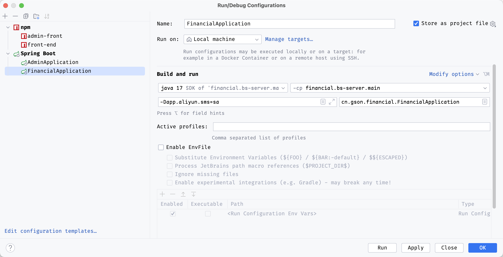
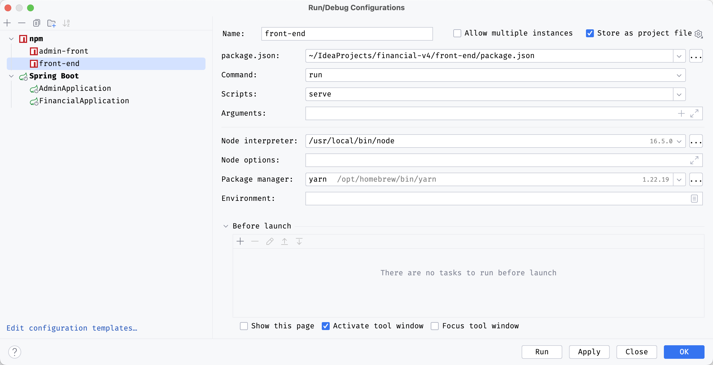
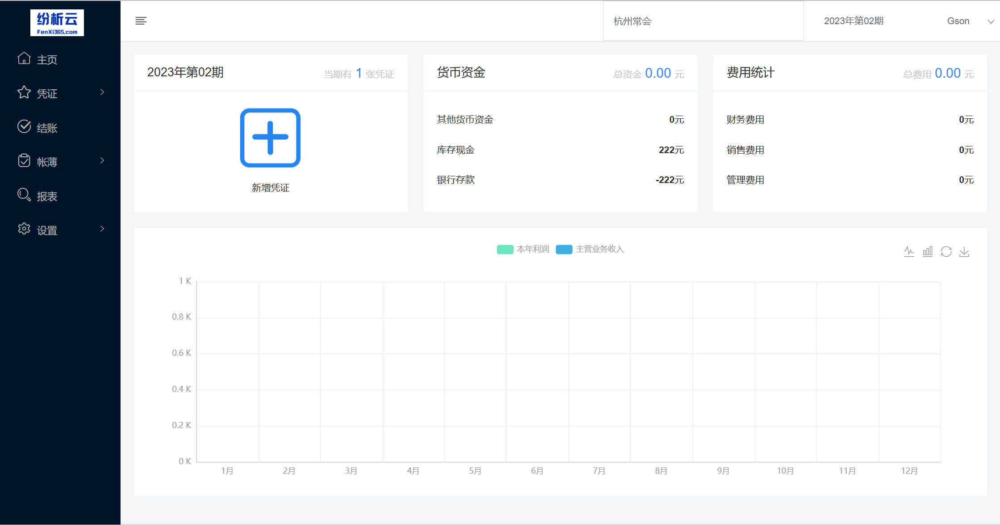
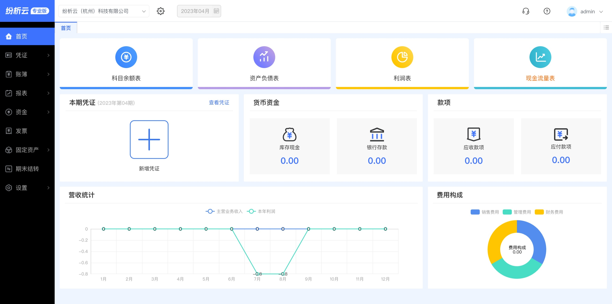
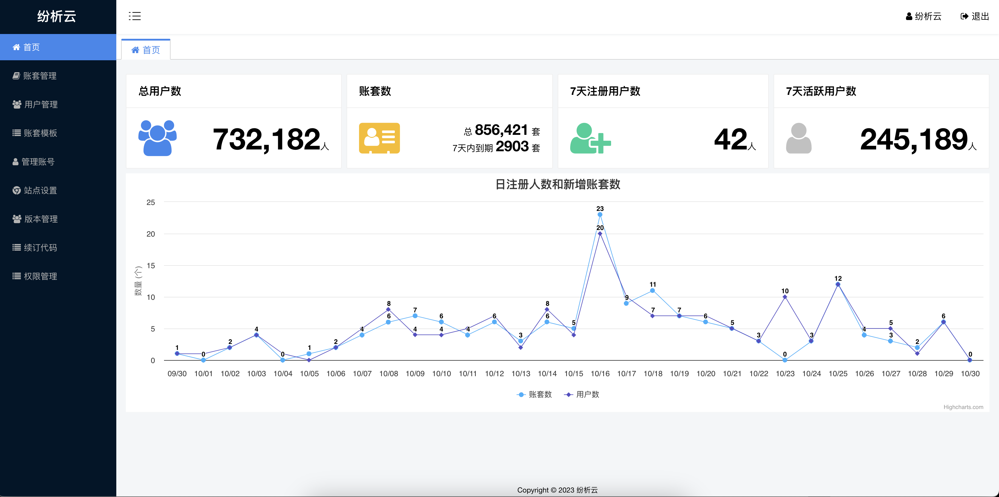

## 纷析云-财务软件源码[开源版]

### 项目介绍
**纷析云SAAS云财务软件开源版** 
包含账套、凭证字、科目、期初、币别、账簿、报表、凭证、结账
### 技术交流群

扫码添加客服进群 

### 开源版地址
纷析云开源版 
https://f.fenxi365.com/ （开源演示版） 
测试账号：13456781004/123456
 

### 商业版地址
纷析云商业版 
https://v4.fenxi365.com/ （商业源码演示版）  

纷析云渠道版 
https://f3.fenxi365.com/  
正式环境，可注册账号直接使用

### 开源版开发环境
软件版本
JDK版本：1.8 
redis 4.0+ 
mysql 5.7+ 
sql_mode关闭only_full_group 
nodejs 16.x 
版本太高前端依赖会构建失败  

开发工具 
intellij idea 2021+  
navicat  

前端框架 
vue2 heyui https://v2.heyui.top/ 
后端框架 
springboot 2+  
mybatis  

运行配置   
后端 
 
前端 
 

### 部署
jar 方式启动 
java -jar financial-0.1.jar 

以Linux程序启动 
./financial-0.1.jar 

### 功能对比 
| 功能模块| 开源版| 商业版[技术重构]| 
|----|----|----|
| 凭证 | ✔ | ✔ | 
| 账簿 | ✔ | ✔ | 
| 报表 | ✔ | ✔ | 
| 结账 | ✔| ✔ | 
| 设置 | ✔ | ✔ | 
| 自定义报表| ✗ | ✔ |
| 资金 | ✗ | ✔ | 
| 固定资产 |✗  | ✔ | 
| 发票 |✗  | ✔| 
| 工资 |✗  | ✔| 
| 商户管理后台 | ✗ | ✔| 

### 数据结构[实体类]

    AccountingCategory          辅助核算项目类别
    AccountingCategoryDetails   辅助核算项目明细
    AccountSets                 账套
    Checkout                    结账
    Currency                    币别
    ReportTemplate              报表模板
    ReportTemplateItems         报表项目
    ReportTemplateItemsFormula  报表公式
    Subject                     科目
    User                        用户管理
    UserAccountSets             用户账套
    Voucher                     凭证
    VoucherDetails              凭证明细
    VoucherDetailsAuxiliary     凭证明细辅助项
    VoucherTemplate             凭证模板
    VoucherTemplateDetails      凭证模板明细
    VoucherWord                 凭证字
### 技术选型
||开源版|商业版|
|----|----|----|
|JDK版本|1.8|17+|
|核心框架|Spring Boot2.x|Spring Boot3.1.x|
|持久层框架|MyBatis|JPA + queryDSL + sqltoy|
|缓存框架|Redis|Redis|
|数据库|mysql 5.7+|mysql8.0+|
|短信接口|阿里云|阿里云|
|前端框架|Vue2,heyui|Vue3,heyui,layer,vxe-table|

### 项目截图

开源版截图 

商业版截图 

> 首页

>管理后台

### 版权许可
    使用本项目代码请遵循GPL3协议，欢迎大家一起进行技术交流和学习，
    如需有商业应用需求，可联系我们为您提供个性化的财务软件源码和需求定制方案！
### 公司介绍 

官网：[https://www.fenxi365.com] (纷析云)  
纷析云（杭州）科技有限公司
